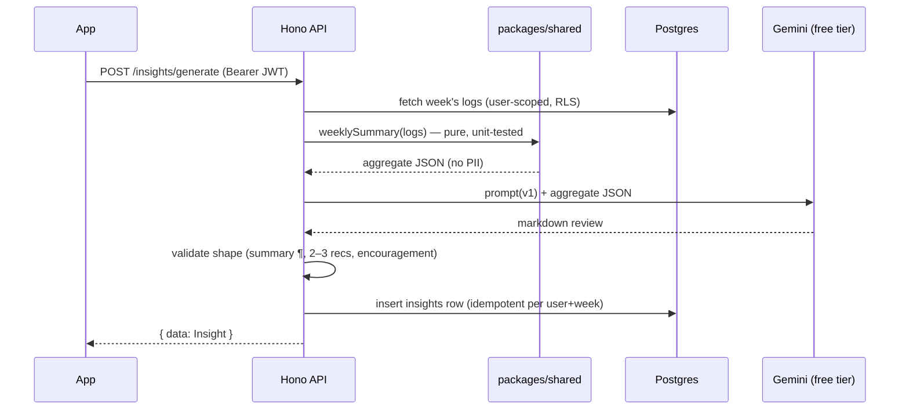

# AI layer — "super knowledge"

> Built in Epic 5 (NWE-501…507). Provider decision (locked): **free-tier Gemini**, called only
> from the Hono API; the key lives in Edge Function secrets and never ships in the app.

## Design principles

> **Agentic Hub exception (owner-approved 2026-07-21).** Principles 1 and 4 below continue to
> govern the one-shot pipelines. NWE-122 deliberately adds open-ended conversation and
> capped raw-row reads through PII-free, user-JWT/RLS-scoped tools. This reverses the earlier
> "artifact-scoped chat" and "aggregates only" decisions for the Hub, without granting writes.

1. **Aggregates in, text out for one-shot pipelines.** Those LLM calls never see raw logs, emails, or identifiers — only the
   computed weekly summary JSON (NWE-501) or, for physique compare, ephemeral photos the user
   explicitly submitted. Only generated **text** is ever stored (in `insights`).
2. **Deterministic core, generative surface.** All numbers (adherence %, trends, volumes) are
   computed by tested code in `packages/shared`; Gemini only interprets and phrases. If the
   model hallucinates a number that isn't in the input, that's a prompt bug — the prompt
   instructs it to use provided figures only.
3. **Versioned prompts.** Every prompt template is a file in the repo (e.g.
   `supabase/functions/api/prompts/weekly-review.v1.ts`); changes bump the version; the
   `insights.model` column records model + prompt version for every generation.
4. **Free-tier quota is a design constraint.** Weekly cadence for one-shot reviews, idempotency
   per (user, week), graceful `RATE_LIMITED` handling with retry messaging in the UI.

## Pipeline: weekly review (NWE-501 → 502 → 503)



**Weekly summary JSON** (`packages/shared/src/insights.ts`):
`weekStart`, `weekEnd`, `nutrition` (days logged, avg daily kcal, calorie target,
adherence %, avg macros, macro gaps), `consistency` (food/workout/water days),
`training` (sessions, volume by muscle group, cardio minutes), `weightTrend`
(first/last kg, raw delta, 7-day moving-average delta), and `water` (avg ml, target ml).
Current implementation keeps the aggregate privacy-safe and deterministic; the API sends only
this JSON to Gemini.

**Output contract** (enforced by prompt + post-validation): one summary paragraph,
2–3 concrete recommendations, one encouragement line. Markdown, short. Local development uses
a deterministic fallback review when `GEMINI_API_KEY` is absent; production should set the key
as an Edge Function secret.

## Pipeline: physique compare (NWE-507)

The user picks two photos ("previous" / "current") at compare time — there is **no stored
photo library requirement**. Photos go through the API to Gemini **in memory only**:

- never written to disk, storage, or DB server-side; only the text feedback is stored
  (`insights`, kind `physique`);
- requires recorded, revocable opt-in consent **before** the first analysis;
- consent copy must be honest: *"Your photos are never stored by us — they leave your device
  only for the moment of analysis, sent to Google's Gemini API"* **plus** the free-tier caveat
  (Google may process free-tier API data to improve its services);
- stats context (weight trend, training volume) is attached when available so feedback is
  grounded, not guesswork.

**Tone constraints** (versioned prompt, non-negotiable):
encouraging and body-neutral · no body-shaming · no medical claims or diagnoses ·
no body-fat-% guesses presented as fact · refusal path if images aren't physique photos ·
feedback framed as observations + 1–2 suggestions, tied to the stats where possible.

Implementation note (2026-07-11): `POST /insights/physique/analyze` requires server-recorded
consent (`PATCH /me/ai-consent`), accepts base64 photos ephemerally, stores only text feedback
in `insights`, and supports feedback deletion via `DELETE /insights/:id`.

## Pipeline: snap-to-log (NWE-508)

```mermaid
sequenceDiagram
    participant App
    participant API as Hono API
    participant G as Gemini vision
    participant FDC as USDA FoodData Central
    participant OFF as Open Food Facts

    App->>API: POST /foods/analyze-photo (photo inline, ephemeral)
    API->>G: prompt + photo
    G-->>API: top-5 dish candidates\n(ingredients + est. quantities + confidence)
    API-->>App: candidates (strict Zod schema)
    App->>App: user picks dish, edits ingredients/quantities
    App->>API: POST /foods/resolve (confirmed ingredients)
    API->>FDC: generic ingredients ("cooked rice")
    API->>OFF: packaged items (brand/barcode)
    API-->>App: per-ingredient macros (unresolved → Gemini estimate, flagged)
    App->>API: POST /food-logs (dish, summed macros,\nsource='ai_photo', ingredient jsonb)
```

Rules: photo processed in memory only (same "never stored by us" promise as physique compare);
portions are estimates — the UI says so and everything is user-editable before logging;
per-user daily quota guard. **Food DB split:** USDA FoodData Central for generic ingredients
(it's built for that), Open Food Facts for packaged products — OFF alone is wrong for "1
medium tomato".

Implementation note (2026-07-11): `POST /foods/analyze-photo` and `POST /foods/resolve` are
strict-schema, mockable endpoints; confirmed AI meals log as a single `food_logs` row with
`source='ai_photo'` and ingredient detail serialized in `source_id`.

## Pipeline: workout generation & adaptation (NWE-509/510)

- **Generation:** setup Q&A (goal, experience, days/week, equipment, constraints) → Gemini
  returns a program as **strict JSON mapped to exercise-library IDs** (never free text into
  the schema; unmatched exercises become custom entries or are rejected). Saved as ordinary
  routines — fully editable, nothing locked. Natural-language adjustments produce a diff.
- **Adaptation:** deterministic, TDD'd detectors in `packages/shared` (plateau by estimated
  1RM, missed sessions, volume drop, rapid progress) decide *when* to act; Gemini proposes
  the concrete routine diff; **the user approves before anything is applied**.

Implementation note (2026-07-11): `POST /routines/generate` returns a strict generated program,
`POST /routines/generated/save` writes generated days as normal routines, and
`POST /routines/:id/adapt` / `apply-diff` store training suggestions in `insights`.

## The coach council (NWE-511)

Three roles — **goal coach** (progress vs goal, target recalibration), **nutrition coach**
(diet proposals grounded in what the user actually logs), **training coach** (program
adherence + adaptation) — implemented as **one orchestrated pipeline with role-specialized
prompt sections over shared context** (weekly summary + goal + program state). Deliberately
NOT independent agents talking to each other: coherence and quota.

Output: one coordinated weekly plan with per-coach attribution in the Insights UI; every
target/program diff requires user approval. Between weeklies, deterministic drop detectors
(logging lapse ≥3 days, weight stall 2+ weeks, volume drop) trigger short check-in notes —
quota-guarded (max one per detector per week), always encouraging in tone.

Implementation note (2026-07-11): `hasEnoughDataForCouncil(summary)` is the boundary between the
simple NWE-502 weekly review and the NWE-511 council. Brand-new/sparse users keep the simple review;
users with at least three food-logging days plus training or weight evidence get the council plan.
`POST /insights/generate` and `POST /insights/council` both use that boundary so the council
replaces the plain weekly review only when the data can support it.

Numeric target proposals are approval-only. `POST /insights/:id/apply-proposal` applies a target
diff only when it belongs to that council plan and the profile targets are not already locked; on
success it saves the target as a locked custom target and stamps the insight's `applied_at`.
`POST /cron/weekly-review` provides the scheduled generation hook for active users and reports push
eligibility after preference/quiet-hour gating.

## Agentic Hub (NWE-122+)

The Hub uses Gemini's Interactions API as a server-side loop in Hono. Each model turn re-sends the
system instruction and MCP-shaped function declarations, streams typed steps, accumulates split
function arguments, executes independent reads concurrently, and continues with
`previous_interaction_id`. Unknown upstream events are skipped for forward compatibility. Safety
limits are enforced in code: 6 steps by default (10 hard maximum), no total-loop timeout
temporarily while Interactions latency is evaluated (the former 45-second deadline remains
available through an explicit test budget), 50 user
messages/day by default (environment-tunable), 200 rows/tool, and 365 days/range.

The `assistant-hub.v2` conversation contract keeps implementation mechanics out of user-facing
copy. Missing data produces one concise follow-up; an explicit log/save/change request with enough
detail calls the relevant proposal tool immediately. Successful proposal turns render the
actionable card inline and use one short acknowledgement rather than repeating the card or talking
about permissions, tools, “the app”, review, or approval. All 19 model-facing tools use explicit,
closed contracts: every nested object lists its fields and rejects undeclared properties; required
fields, enums, ranges, dates, UUIDs, and array bounds are advertised to Gemini and enforced again by
strict Zod parsing. Tool-specific proposal calls omit the redundant persisted `kind` discriminator;
the selected tool supplies that constant. Intentional flexibility is represented explicitly—for
example, program sets/reps accept either a positive number or a bounded coach-style string, food-log
versus recipe intent uses separate tools, and food-log date versus date-range reads use a union.
Workout calls require title, resolved date, exercise kind, and compact `{count, reps, weight_kg}`
(or cardio) set groups. The server does not guess missing arguments; it only expands an explicitly
supplied set count and adds the discriminator already implied by the selected tool. Gemini runs with
`tool_choice: validated`, which preserves text-or-tool selection while constraining function calls
to their declarations. A
malformed tool call is returned privately to the interaction as `invalid_arguments` for a corrected
same-turn retry; schema/tool details are logged for diagnosis and never shown in the chat bubble.

The registry separates reads from approval-only proposal artifacts:

- profile/targets, workout trends and bounded workouts, exercise history, routines;
- bounded food logs and nutrition trends, weight trend, coach memory;
- packaged-food search, ingredient nutrient resolution, and saved-recipe reads.

Every database tool uses the request's user-JWT Supabase client, so RLS is the authorization
boundary. Returned data omits user IDs, emails, photo paths, and source identifiers. The system
instruction supplies the current ISO date so “today” and other relative log dates resolve before
a proposal is created. It prohibits medical claims and requires body-neutral language; allergies
and injuries are hard constraints. The dispatcher validates both `kind:'read'` and
`kind:'proposal'` calls, but
never mutates for a proposal. Program, meal-plan, food-log, workout-log, recipe, and target proposals are stored as
owned assistant insights. Only the authenticated apply endpoint can revalidate and apply one;
repeat approval is idempotent, allergies remain absolute, and locked targets are refused.

Rich food proposals carry 1–30 ingredients with per-100 g macro bases, nullable micronutrients,
and per-row provenance (`usda`, `openfoodfacts`, or `estimated`). Resolution is deterministic in
that order; only an unresolved ingredient reaches Gemini, optionally through the cheaper
`GEMINI_NUTRIENT_MODEL`. Review-sheet quantity/deletion/set edits are local calculations and spend
no AI call. Adding or swapping an ingredient calls `/foods/resolve` once. Approval submits the
edited snapshot, validates it again server-side, and stores ingredient detail in the existing
`food_logs.ingredients` JSONB. Allergy enforcement inspects structured ingredients and known
synonyms/derivatives rather than stringifying the proposal.

Workout-log proposals resolve exercise names against the visible exercise library and reuse the
same transactional workout service as `POST /workouts`; unmatched exercises remain explicit and
block approval until the user picks one. Food-log proposals can independently be saved as recipes.
Proposal revisions carry `supersedes_insight_id`: the previous artifact is retained but marked
`dismiss_reason='superseded'`, collapsed in the thread, and permanently non-actionable.

Conversations persist in `assistant_threads`/`assistant_messages`; assistant messages keep the
user-visible `tool_trace` rendered by the Hub's "What I looked at" disclosure. Gemini continuity requires
`store=true`: Google's Interactions service currently retains stored interactions for 1 day on the
free tier and 55 days on the paid tier. The product must disclose that retention before the NWE-123
Hub UI ships; that disclosure is present in both the Hub empty state and Profile. Photos and emails
are never sent to the Hub.

All Gemini features now share the Interactions transport. Program and meal-plan refinement store
their interaction and continue with `previous_interaction_id`; prompt attribution is
`program-refine.v2` / `meal-plan-refine.v2`. Weekly review, council, physique comparison, workout
generation, meal-plan generation, meal-photo analysis, routine diffs, and memory distillation use
`store=false`, so one-shot work creates no retained interaction state. Photo inputs use ephemeral
Interactions image parts and are never written server-side. The legacy `generateContent` transport
has been removed. `ASSISTANT_INTERACTIONS_REFINE=off` temporarily switches refiners to bounded
history-in-prompt compatibility mode while still using the common Interactions transport.

## Later AI stories

- **NWE-127** — expose the registry as remote MCP only when the chosen Gemini model supports it
  without weakening per-user authentication or privacy.
- The former **NWE-505 coach chat** is superseded by this Hub epic.

## Failure & privacy rules (all AI endpoints)

- Gemini quota/timeouts → no partial DB rows, `RATE_LIMITED`/`UPSTREAM_ERROR` envelope, UI
  explains and offers retry later.
- All AI endpoints are auth-gated; physique compare additionally checks stored consent.
- Deleting a generated insight is always available to the user.
- App Store disclosure (NWE-803): health data collected; photos on-device except opt-in
  ephemeral AI analysis by Google Gemini.
