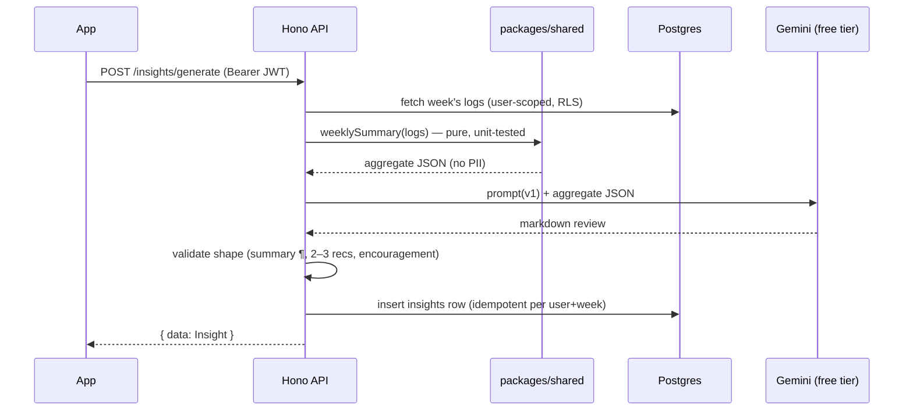

# AI layer — "super knowledge"

> Built in Epic 5 (NWE-501…507). Provider decision (locked): **free-tier Gemini**, called only
> from the Hono API; the key lives in Edge Function secrets and never ships in the app.

## Design principles

1. **Aggregates in, text out.** The LLM never sees raw logs, emails, or identifiers — only the
   computed weekly summary JSON (NWE-501) or, for physique compare, ephemeral photos the user
   explicitly submitted. Only generated **text** is ever stored (in `insights`).
2. **Deterministic core, generative surface.** All numbers (adherence %, trends, volumes) are
   computed by tested code in `packages/shared`; Gemini only interprets and phrases. If the
   model hallucinates a number that isn't in the input, that's a prompt bug — the prompt
   instructs it to use provided figures only.
3. **Versioned prompts.** Every prompt template is a file in the repo (e.g.
   `supabase/functions/api/prompts/weekly-review.v1.ts`); changes bump the version; the
   `insights.model` column records model + prompt version for every generation.
4. **Free-tier quota is a design constraint.** Weekly cadence (not chat-first), idempotency
   per (user, week), graceful `RATE_LIMITED` handling with retry messaging in the UI.

## Pipeline: weekly review (NWE-501 → 502 → 503)



**Weekly summary JSON** (shape owned by NWE-501 — document the final schema there and here):
avg daily kcal vs target, adherence %, macro gaps, days-logged consistency, training sessions +
volume by muscle group, cardio minutes, weight trend (first/last/7-day-MA delta), water avg.

**Output contract** (enforced by prompt + post-validation): one summary paragraph,
2–3 concrete recommendations, one encouragement line. Markdown, short.

## Pipeline: physique compare (NWE-507)

The user picks two photos ("previous" / "current") at compare time — there is **no stored
photo library requirement**. Photos go through the API to Gemini **in memory only**:

- never written to disk, storage, or DB server-side; only the text feedback is stored
  (`insights`, kind `physique`);
- requires recorded, revocable opt-in consent **before** the first analysis;
- consent copy must be honest: *"Your photos are never stored by us — they leave your device
  only for the moment of analysis, sent to Google's Gemini API"* **plus** the free-tier caveat
  (Google may process free-tier API data to improve its services);
- stats context (weight trend, training volume) is attached when available so feedback is
  grounded, not guesswork.

**Tone constraints** (versioned prompt, non-negotiable):
encouraging and body-neutral · no body-shaming · no medical claims or diagnoses ·
no body-fat-% guesses presented as fact · refusal path if images aren't physique photos ·
feedback framed as observations + 1–2 suggestions, tied to the stats where possible.

## Pipeline: snap-to-log (NWE-508)

```mermaid
sequenceDiagram
    participant App
    participant API as Hono API
    participant G as Gemini vision
    participant FDC as USDA FoodData Central
    participant OFF as Open Food Facts

    App->>API: POST /foods/analyze-photo (photo inline, ephemeral)
    API->>G: prompt + photo
    G-->>API: top-5 dish candidates\n(ingredients + est. quantities + confidence)
    API-->>App: candidates (strict Zod schema)
    App->>App: user picks dish, edits ingredients/quantities
    App->>API: POST /foods/resolve (confirmed ingredients)
    API->>FDC: generic ingredients ("cooked rice")
    API->>OFF: packaged items (brand/barcode)
    API-->>App: per-ingredient macros (unresolved → Gemini estimate, flagged)
    App->>API: POST /food-logs (dish, summed macros,\nsource='ai_photo', ingredient jsonb)
```

Rules: photo processed in memory only (same "never stored by us" promise as physique compare);
portions are estimates — the UI says so and everything is user-editable before logging;
per-user daily quota guard. **Food DB split:** USDA FoodData Central for generic ingredients
(it's built for that), Open Food Facts for packaged products — OFF alone is wrong for "1
medium tomato".

## Pipeline: workout generation & adaptation (NWE-509/510)

- **Generation:** setup Q&A (goal, experience, days/week, equipment, constraints) → Gemini
  returns a program as **strict JSON mapped to exercise-library IDs** (never free text into
  the schema; unmatched exercises become custom entries or are rejected). Saved as ordinary
  routines — fully editable, nothing locked. Natural-language adjustments produce a diff.
- **Adaptation:** deterministic, TDD'd detectors in `packages/shared` (plateau by estimated
  1RM, missed sessions, volume drop, rapid progress) decide *when* to act; Gemini proposes
  the concrete routine diff; **the user approves before anything is applied**.

## The coach council (NWE-511)

Three roles — **goal coach** (progress vs goal, target recalibration), **nutrition coach**
(diet proposals grounded in what the user actually logs), **training coach** (program
adherence + adaptation) — implemented as **one orchestrated pipeline with role-specialized
prompt sections over shared context** (weekly summary + goal + program state). Deliberately
NOT independent agents talking to each other: coherence and quota.

Output: one coordinated weekly plan with per-coach attribution in the Insights UI; every
target/program diff requires user approval. Between weeklies, deterministic drop detectors
(logging lapse ≥3 days, weight stall 2+ weeks, volume drop) trigger short check-in notes —
quota-guarded (max one per detector per week), always encouraging in tone.

## Later AI stories (parked)

- **NWE-505 coach chat** — free-form chat with the council; needs quota budgeting and
  guardrails; depends on the council existing first.

## Failure & privacy rules (all AI endpoints)

- Gemini quota/timeouts → no partial DB rows, `RATE_LIMITED`/`UPSTREAM_ERROR` envelope, UI
  explains and offers retry later.
- All AI endpoints are auth-gated; physique compare additionally checks stored consent.
- Deleting a generated insight is always available to the user.
- App Store disclosure (NWE-803): health data collected; photos on-device except opt-in
  ephemeral AI analysis by Google Gemini.
