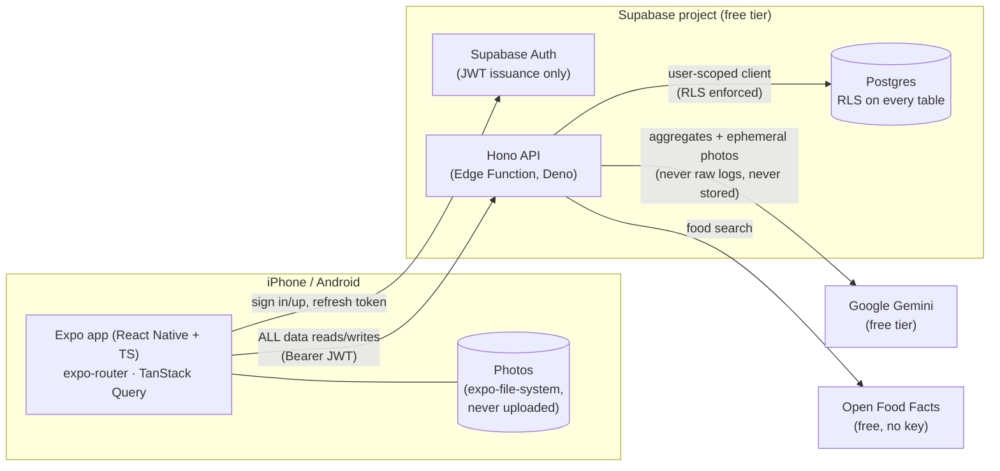
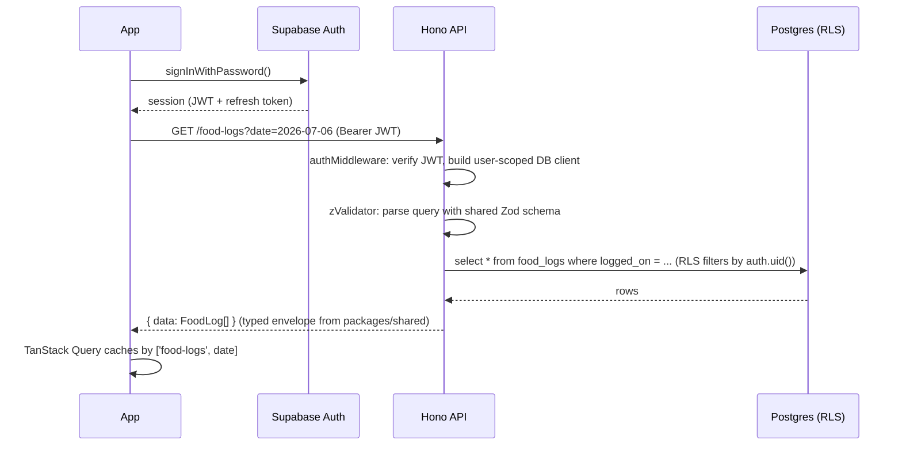

# Architecture

> ⚠️ **Current vs target.** The repo currently contains the pre-M1 scaffold: screens query
> Supabase directly. Everything in this document describes the **target architecture** decided
> in [TASKS.md](../TASKS.md) (built by stories NWE-110…116). Where the current state differs,
> it is called out explicitly. If this doc and TASKS.md conflict, TASKS.md wins.

## System overview

**The one rule that defines this architecture:** the app never talks to the database.
`supabase-js` exists in the app **only** for auth (sign in/up, session persistence, token
refresh). Every read and write goes through the Hono API with the user's JWT attached.
After NWE-114 this is enforced by CI (no `supabase.from(` in app code).

## Layers

| Layer | Tech | Lives in | Responsibility |
|---|---|---|---|
| Mobile app | Expo SDK 57, expo-router, TanStack Query | repo root (`app/`, `components/`, `lib/`) | UI, navigation, local photo storage, calling the API |
| Shared domain | TypeScript + Zod | `packages/shared/` | API contracts (request/response schemas), domain types, pure logic (nutrition math, aggregations, streaks) — imported by BOTH app (Metro) and API (Deno) |
| API | Hono on Supabase Edge Functions (Deno) | `supabase/functions/api/` | Auth verification, validation, business rules, DB access, third-party calls (Open Food Facts, Gemini) |
| Database | Postgres (Supabase) | `supabase/migrations/` | Storage, RLS as defense-in-depth, indexes |

Why each decision was made (short form; full history in TASKS.md "Locked decisions"):

- **Hono over NestJS/FastAPI** — one language end-to-end, shared Zod contracts mean a contract
  change fails compilation on both sides; runs inside Supabase (zero extra hosting); portable to
  Node/Bun/Workers/VPS with a tiny adapter if we ever leave.
- **RLS stays on even though the API is the only client** — the API creates a per-request
  Supabase client with the **caller's JWT**, so even a bug in an endpoint cannot read another
  user's rows. The service-role key is used only where genuinely required and never leaves the
  backend.
- **Photos on-device only** — privacy is a product feature ("your photos are never stored").
  For opt-in AI analysis, photos travel through the API to Gemini in memory and only the text
  result is kept.

## Request lifecycle (target)

Error path: any failure returns the shared error envelope
`{ error: { code, message } }` with an appropriate HTTP status — see [api.md](api.md).

## Environments

| Environment | Database | API | Used for |
|---|---|---|---|
| **Local** | Postgres in Docker (`supabase start`) | `supabase functions serve` | Development, unit + integration tests. Free, unlimited, no network needed. |
| **Hosted** | Supabase cloud project (free tier) | Deployed Edge Function | The real app on the phone; deployed from `main` by GitHub Actions (NWE-115). |

Free-tier operational notes: the hosted project **pauses after 7 idle days** (resume from the
dashboard); the free tier has **no backups**, so NWE-115 adds a scheduled `pg_dump` export.
Cost stance: $0 for personal use; first paid step would be Supabase Pro ($25/mo) only if the
app gains hundreds of active users; escape hatches documented (self-host Supabase on a VPS,
move Hono anywhere, `pg_dump` restores to any Postgres).

## Security model

1. **Authentication** — Supabase Auth issues JWTs; the API verifies them in middleware on every
   route except `GET /health`. No custom password handling anywhere.
2. **Authorization** — two layers: endpoints only operate on the authenticated user's data
   (explicit `user_id` scoping in queries), and Postgres RLS re-enforces it underneath.
3. **Secrets** — Gemini API key and service-role key exist only as Edge Function secrets.
   The app ships only `EXPO_PUBLIC_SUPABASE_URL` and the anon key (both are public by design;
   the anon key grants nothing without a user JWT thanks to RLS).
4. **Third parties** — the app never calls Open Food Facts or Gemini directly; the API proxies
   both, which is where rate limiting and abuse control live.
5. **Photos** — never persisted server-side; ephemeral pass-through for opt-in analysis only,
   with honest consent copy (see [ai.md](ai.md)).

## Current state (pre-M1) — what actually exists today

- Expo scaffold with 4 tabs (Today / Food / Workouts / Profile) + email/password auth.
- Screens call `supabase.from(...)` directly (to be replaced by NWE-114).
- Single `supabase/schema.sql` (becomes migration 0001 in NWE-110).
- Food search calls Open Food Facts from the client (`lib/food-api.ts`, moves behind the API
  in NWE-114).
- No tests, no API, no `packages/shared` yet — that's M1.
