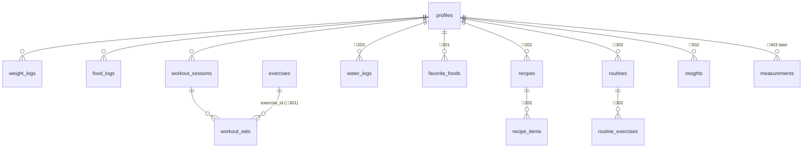

# Data model

> **The full v1.0 schema lives in [`supabase/schema.sql`](../supabase/schema.sql)** (designed
> 2026-07-07 from the complete backlog, with inline comments explaining every "why"). NWE-110
> converts it verbatim into `supabase/migrations/0001_init.sql`; later stories add numbered
> migrations only for genuine design changes. Markers below: ✅ = the app feature using the
> table exists · 🚧 = table exists in the schema, its feature story hasn't been built yet.
> Feature stories **verify their tables against real needs** (and document deviations) rather
> than designing them from scratch.
>
> **Tracking columns convention:** every table has `created_at`; mutable tables have
> `updated_at` maintained by the `handle_updated_at` trigger (never by app code). Lifecycle
> timestamps where stories need them: `seen_at` (badges → dashboard banner), `read_at`
> (insights → "first review read" badge), `applied_at`/`dismissed_at` (coach proposals →
> approve/dismiss + detector snooze). Consent is a timestamp (`photo_ai_consented_at`), not a
> boolean — privacy reviews ask *when*, not just *if*.

## Principles

- **Every user table**: `user_id uuid` referencing `auth.users(id) on delete cascade`, RLS
  enabled with `auth.uid() = user_id` policies, index on `(user_id, logged_on desc)` where
  day-scoped. No exceptions — CI/review should reject a migration without RLS.
- **Day-scoped data** uses `logged_on date` (device-local `YYYY-MM-DD` computed by the client).
- **Denormalize nutrition into log rows.** `food_logs` stores name + macros at log time, so
  history stays accurate if the source food/recipe changes later. Same idea for workout sets
  (exercise text kept alongside `exercise_id`).
- Schema changes ship as **new idempotent migration files** — never edit an applied migration.

## Entity overview



## Tables

### ✅ profiles — one row per user, auto-created on signup (trigger `handle_new_user`)
`id (= auth.uid)`, `display_name`, `sex ('male'|'female')`, `birth_year`, `height_cm`,
`activity_level (sedentary|light|moderate|active|very_active)`,
`goal_type (lose|maintain|gain)`, `target_weight_kg`,
`calorie_target`, `protein_target_g`, `carbs_target_g`, `fat_target_g`, timestamps.
Planned additions: `water_target_ml default 2000` (🚧203), `targets_locked bool` (🚧404),
AI consent flag (🚧507).

### ✅ weight_logs
`weight_kg`, `logged_on` — **unique (user_id, logged_on)**, upserted (one weigh-in per day).

### ✅ food_logs
`food_name`, `brand`, `meal_type (breakfast|lunch|dinner|snack)`, `quantity_g`,
`calories`, `protein_g`, `carbs_g`, `fat_g` (all for the logged quantity, denormalized),
`source ('manual'|'openfoodfacts')` + `source_id` (barcode), `logged_on`.
Planned: `source='recipe'` (🚧202), `photo_path` — **device-local filename, not a URL;
photo exists only on the device that logged it** (🚧204).

### ✅ workout_sessions / ✅ workout_sets
Sessions: `title`, `notes`, `duration_min`, `logged_on`.
Sets: `session_id (cascade)`, `user_id`, `exercise text`, `set_number`, `reps`, `weight_kg`,
`duration_min`. Planned: `exercise_id` FK (🚧301), `distance_km` for cardio (🚧304).

### 🚧 exercises (NWE-301)
`user_id nullable` — **null = global seed row** (~50 common exercises seeded by migration),
`name`, `muscle_group`, `kind (strength|cardio)`. RLS: read global + own; write own only.

### 🚧 earned_badges (604) — user_id, badge_id, earned_on; unique (user_id, badge_id); catalog lives in code (`packages/shared`), not the DB

### 🚧 push_tokens (607) — user_id, expo_token, device label, updated_at; RLS; notification prefs (categories + quiet hours) live on the profile or a jsonb column

### 🚧 favorite_foods (201) · recipes + recipe_items (202) · water_logs (203) · routines + routine_exercises (302) · push_tokens (607)
Full definitions in `schema.sql`; the owning story writes the matching Zod schemas in
`packages/shared` and adjusts columns via a new migration only if the build reveals a gap.
Deliberately absent: `measurements` (post-v1.0, NWE-403) and `quest_days` (NWE-605 computes
on read first).

### 🚧 insights (NWE-502)
`user_id`, `kind ('weekly'|'physique')`, `week_start date` (weekly only, unique per user+week),
`content` (markdown), `model`, `created_at`. **Never stores images** — physique rows hold text
feedback only.

## What is deliberately NOT in the database

- **Photos** — on-device only (`expo-file-system`); DB stores at most a local filename.
- **Raw third-party payloads** — Open Food Facts results are normalized at the API boundary.
- **LLM inputs** — Gemini receives aggregates/ephemeral photos; only its text output is stored.

## Migrations workflow (post NWE-110)

```
supabase migration new <name>     # create supabase/migrations/NNNN_<name>.sql
supabase db reset                 # replay all migrations + seed on local Docker stack
# integration tests run against this local stack
# deploy to hosted project via GitHub Action (NWE-115): supabase db push
```

The hosted (free-tier) project has **no automatic backups** — a scheduled `pg_dump` export is
part of NWE-115. Free-tier projects pause after 7 idle days; resume from the dashboard.
