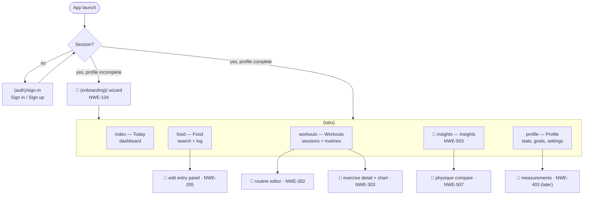
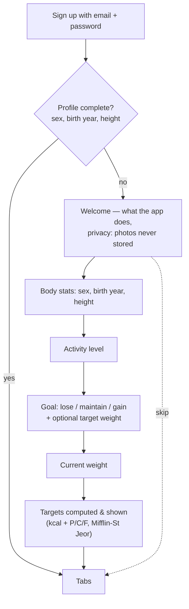
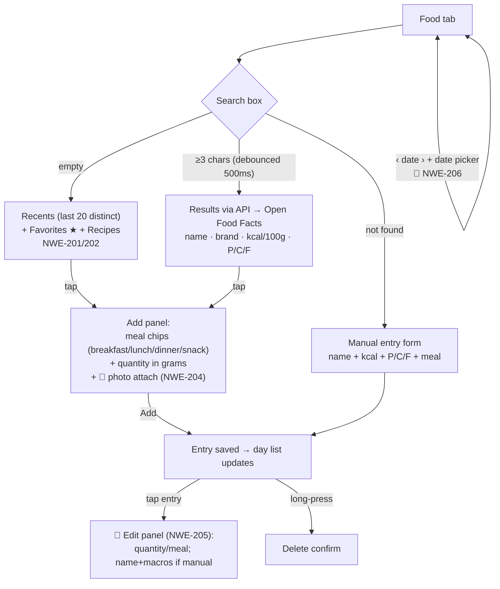
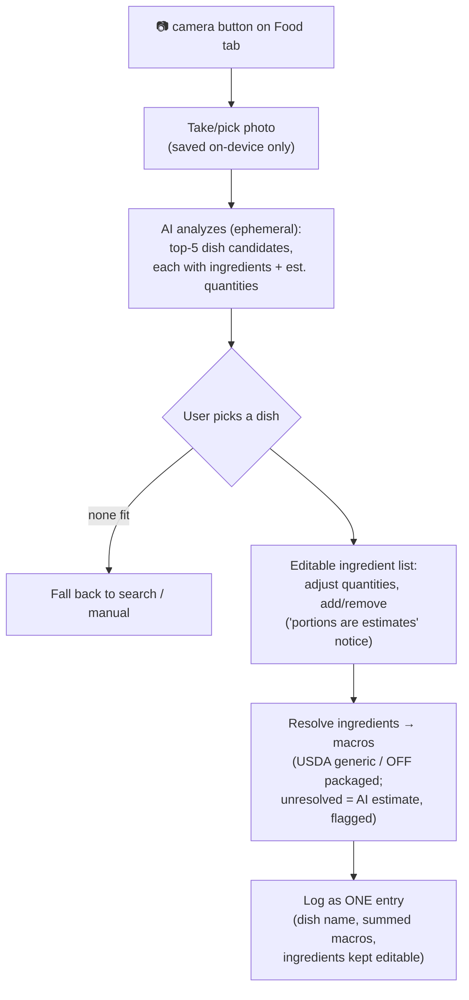
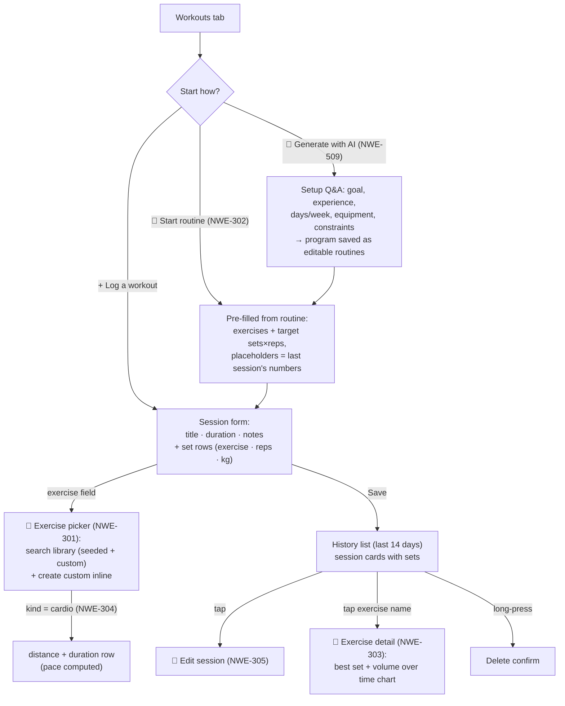
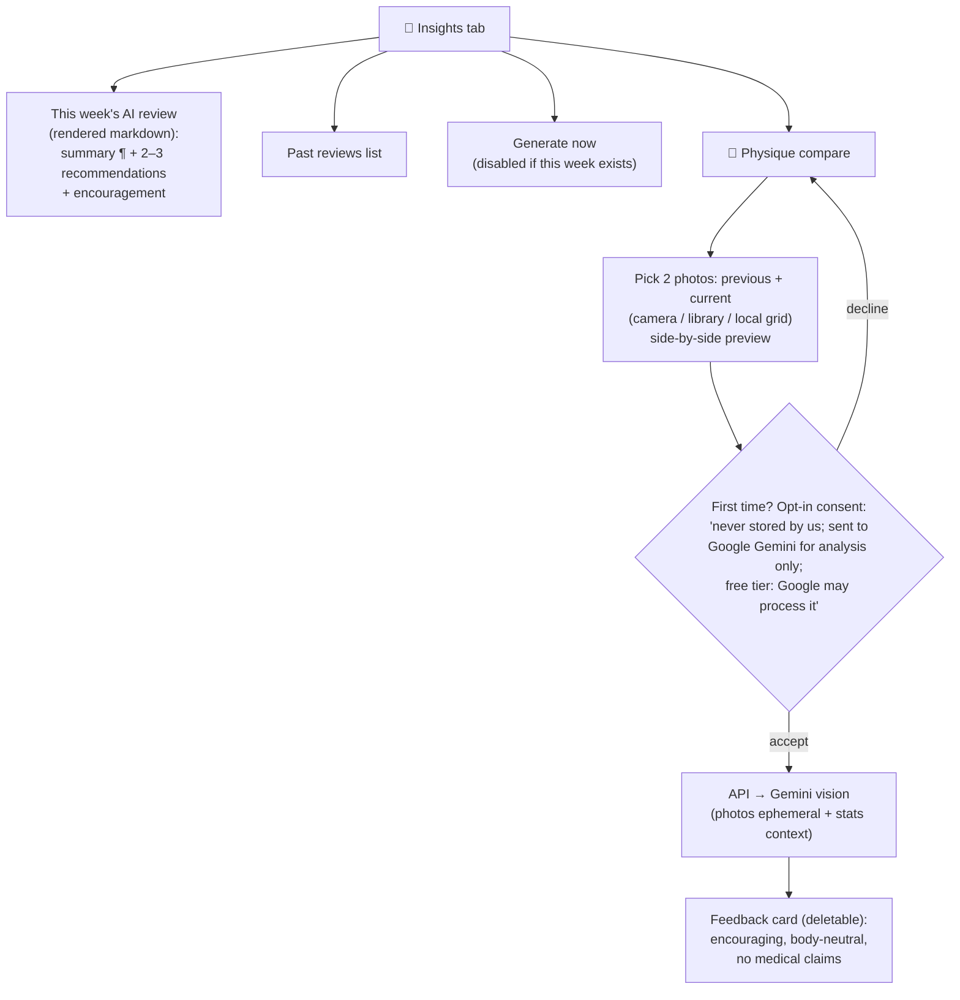

# UI flows

> **Visual companion:** [`wireframes.html`](wireframes.html) — annotated phone-frame wireframes
> for every v1.0 screen, keyed by story ID. This file describes flows; that file shows layout.
> Screens marked 🚧 don't exist yet — the story ID says where they come from.
> Visual language: themed light/dark via `components/Themed.tsx`, accent `#16a34a`,
> destructive `#dc2626`, cards + progress bars from `components/ui.tsx`. Metric units.

## Screen map

## Auth & onboarding (NWE-104)

Rules: skippable at any step; re-runnable from Profile; existing complete profiles never see it.

## Today dashboard

Reads (single API call or parallel queries): today's food totals, water total, latest weight,
today's workout sessions, profile targets, streak (NWE-602).

Top-to-bottom layout: greeting + date → 🚧 **macro rings** (NWE-406: three concentric rings
for protein/carbs/fat vs targets, largest target outermost, calories in the center,
Apple-style overshoot marker; replaces the interim macro bars — protein `#dc2626`, carbs
`#f59e0b`, fat `#3b82f6`, always with text labels, never color alone) → water bar (NWE-203)
→ weight card with trend chart (NWE-401: 30/90-day toggle, dots + 7-day moving average +
dashed target line) → today's workouts. Pull-to-refresh; every tab refetches on focus.

### Analytics surfaces (🚧 NWE-407/408/409)

Glanceable, curated — not a BI dashboard. Entry points: chart icon in the Food tab header →
food analytics (adherence calendar heatmap, daily macro split, meal-type split, top foods);
chart icon in Workouts → gym analytics (weekly volume by muscle group, consistency + streaks,
PR feed, cardio trends); goal analytics (weight projection with honest ETA from tested math,
pace vs plan, adherence↔progress) lives in Profile or Insights. Days without logs render as
missing, never zero.

## Food logging

Day list is grouped by meal with per-meal and daily totals (kcal + P/C/F). Water widget with
+250/+500 ml buttons and undo lives at the top of this tab or the dashboard (NWE-203).

### Snap-to-log (🚧 NWE-508)

## Workout logging

## Insights (NWE-503) & physique compare (NWE-507)

Empty state for Insights explains what weekly reviews are and when the first one arrives.
"Your photos are never stored" is repeated on the compare screen itself.

Coach council (🚧 NWE-511): the weekly review grows into a coordinated plan with per-coach
attribution — goal coach (target diffs), nutrition coach (diet proposals), training coach
(program adjustments from NWE-510). Every diff is approve/dismiss, never auto-applied.
Between weeklies, drop detectors (logging lapse, weight stall, volume drop) surface short
encouraging check-in notes here.

## Profile

Sections top-to-bottom: today's weight quick-log (upsert per day) → about you (name, sex,
birth year, height) → activity level → goal + target weight ("View progress →" opens goal
analytics, 🚧 NWE-409) → current computed targets (with 🚧 NWE-404 "custom targets" lock
toggle) → 🚧 Progress photos (NWE-405) → 🚧 Badges (NWE-604) → 🚧 Notifications screen
(NWE-607/601: master + per-category toggles, reminder time pickers, quiet hours; OS permission
asked in-context on first enable, never at launch) → 🚧 AI consent toggle (revoke NWE-507) →
🚧 Account section (NWE-117: change password · export my data · delete account, red,
type-DELETE confirm) → sign out (confirm dialog, red).

Saving recomputes targets automatically unless `targets_locked` — the save confirmation
always states the resulting numbers.

## Gamification (🚧 NWE-602/604/605/606)

Dashboard carries the engagement loop: **daily quests widget** (3–5 auto-completing quests
derived from the user's own goals — completing the real action checks them off, no manual
ticking; all done = "perfect day") + **streak counter** (logging streak; stricter perfect-day
streak). **Badge gallery** lives off Profile: earned with dates, locked ones greyed with an
encouraging "how to earn" hint. Guardrail: celebrate real actions, never guilt/FOMO; rest days
respected (workout quest becomes recovery/water).

**Motion language (NWE-606):** one shared celebration system — Reanimated micro-interactions
(check-offs, ring fills, count-ups) + hero moments (badge unlock burst/confetti) + haptics.
Durations/easing defined as tokens once. Reduced-motion setting → static fallbacks; animations
never block input.

## Cross-cutting UX rules

- Every screen must have a designed **empty state** (first-run) and **loading state**
  (no flash of wrong content while session/profile loads).
- API failures: dismissible banner + TanStack Query retry — never a silent blank screen
  (NWE-105). Food search failure shows inline feedback under the search box.
- Destructive actions always confirm (`Alert`), destructive buttons red.
- Copy tone: encouraging, never guilt-tripping (streak-break copy is gentle; AI prompts
  body-neutral).
- Critical paths covered by Maestro E2E flows: sign in → log food → dashboard reflects it;
  log workout; (later) generate insight.
